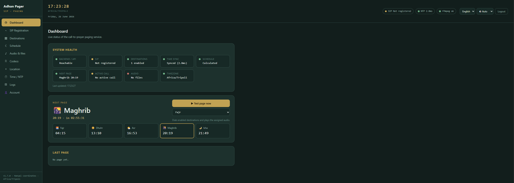
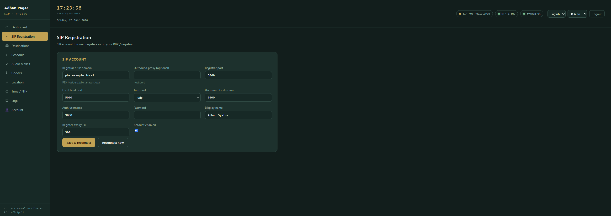
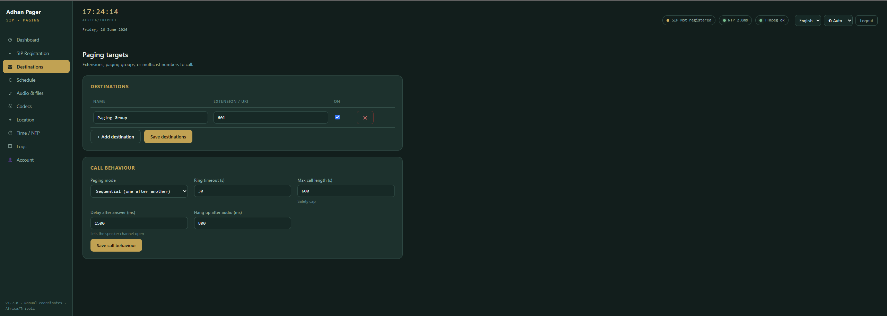
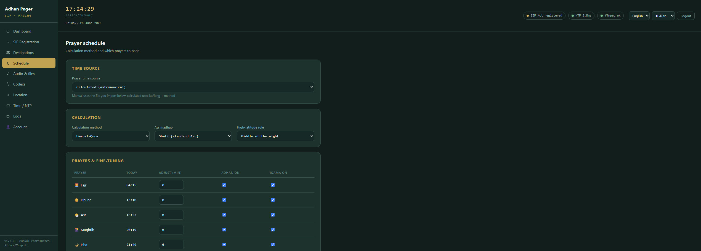
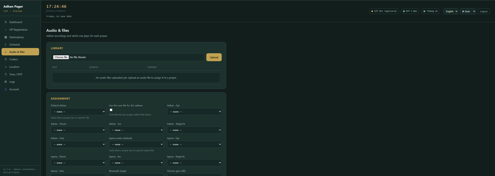
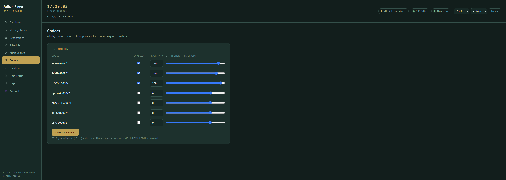
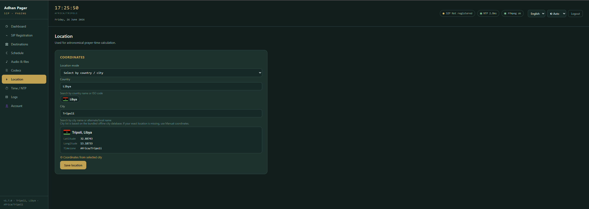
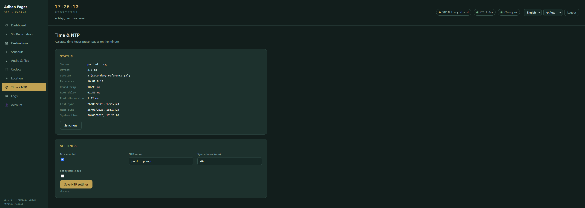
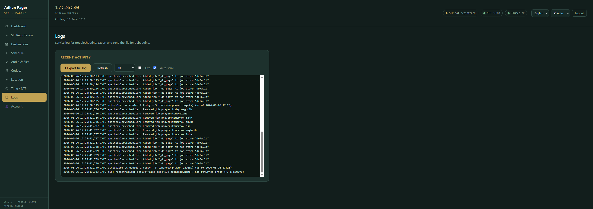
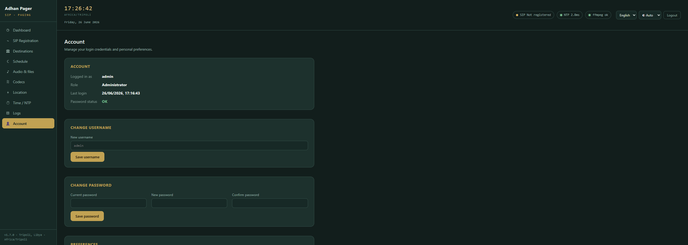

<p align="center">
  
</p>

# Adhan Pager

**English:** Adhan Pager is a self-hosted SIP paging service for mosques, Islamic centers, schools, offices, and shared buildings. It calculates prayer times, calls one or more SIP extensions or paging groups through your PBX, plays the correct Adhan audio, and hangs up automatically when playback finishes.

**العربية:** أدان بيجر هو نظام ذاتي الاستضافة لبث الأذان عبر الاتصالات الداخلية `SIP` للمساجد والمراكز الإسلامية والمدارس والمكاتب والمباني المشتركة. يقوم بحساب أوقات الصلاة، والاتصال بامتدادات أو مجموعات نداء عبر السنترال، ثم تشغيل ملف الأذان المناسب وإنهاء المكالمة تلقائياً عند انتهاء الصوت.

## English

### License

This project is licensed under `PolyForm Noncommercial 1.0.0`.

- You may use, fork, study, and modify it for noncommercial purposes.
- You may share copies and your modifications under the same license terms.
- You may not resell it or use it commercially without separate permission.

This is source-available, not a standard open-source commercial-use license. See [LICENSE](LICENSE).

### What this project is used for

- Automatically broadcast the Adhan through a PBX paging system.
- Call one extension, multiple extensions, or a paging group at each prayer time.
- Run a dedicated on-premise Adhan service without relying on cloud services.
- Manage prayer schedule, audio files, codecs, SIP registration, and location from a web interface.
- Optionally trigger a second page for iqama after a configurable delay.

### Main features

- Offline prayer-time calculation with `adhanpy`.
- Web control panel for SIP, schedule, destinations, audio, codecs, NTP, and location.
- SIP paging support over `UDP`, `TCP`, or `TLS`.
- Separate audio assignment for Fajr and other prayers.
- Automatic hang-up exactly after playback ends.
- Optional manual timetable import.
- Offline city and country lookup using `geonamescache`.
- Docker-based deployment with persistent config and audio storage.

### Screenshots

These screenshots show the main sections of the control panel so deployers can quickly understand the workflow before installation.

#### Dashboard



Live health overview with current time, backend status, SIP registration state, NTP sync, the next prayer page, and one-click test paging.

#### SIP Registration



Configure the PBX registrar, transport, username, authentication details, and reconnection behavior for the SIP account used by the service.

#### Destinations



Define the paging targets that receive the Adhan, including extensions, paging groups, and call behavior such as sequential or parallel paging.

#### Schedule



Choose the prayer-time source, calculation method, madhab, high-latitude rule, and per-prayer enable/adjust settings, including optional iqama paging.

#### Audio & Files



Upload Adhan audio, assign separate files per prayer, and manage iqama audio, resampling targets, and volume behavior.

#### Codecs



Prioritize SIP codecs for compatibility and audio quality, with clear control over preferred codecs such as `G722`, `PCMA`, and `PCMU`.

#### Location



Set the calculation location using the built-in offline country/city database or manual coordinates and timezone input.

#### Time & NTP



Monitor NTP health, offset, stratum, and synchronization timing, and control how often the service refreshes system time data.

#### Logs



Review live service logs for troubleshooting SIP registration, scheduling, audio, and runtime events, with export support for support and debugging.

#### Account



Manage the authenticated admin account, change the username and password, and review account-specific information from within the app.

### Recommended deployment

- Use Docker on a Linux host when possible.
- Use `network_mode: host` for the most reliable SIP and RTP behavior.
- Create a dedicated SIP extension or paging account on your PBX.
- Upload clean, trimmed Adhan recordings for better paging quality.
- Keep NTP enabled so prayer times remain accurate.

### Installation with Docker (recommended)

```bash
git clone https://github.com/abdlmalekluttee/adhan-pager.git
cd adhan-pager
./scripts/preflight.sh
docker compose up -d --build
```

`docker compose up -d --build` installs the app requirements inside the container image automatically, including the system packages, Python dependencies, `ffmpeg`, and the compiled `pjsua2` bindings. The host VM itself mainly needs Docker, Docker Compose, enough disk space, and a Linux-friendly networking setup for SIP.

### VM readiness check

Before deployment, run:

```bash
./scripts/preflight.sh
```

If you want one copy-paste command for both validation and deployment:

```bash
git clone https://github.com/abdlmalekluttee/adhan-pager.git && cd adhan-pager && ./scripts/preflight.sh && docker compose up -d --build
```

Then open:

```text
http://<server-ip>:8080
```

### Default login

On first run, sign in with:

```text
username: admin
password: admin
```

The app immediately forces you to change the password before using the control panel.

If you ever need to intentionally reset the login back to the default account, stop the container and delete `config/users.json`, then start the service again.

### First-time setup

1. Open the web interface and sign in with the default login above.
2. Change the default password when prompted.
3. Go to `Server` and enter your PBX address, username, password, transport, and port.
4. Go to `Location` and select your city or enter manual coordinates and timezone.
5. Upload your Adhan files from `Audio & files`.
6. Add one or more destinations in `Destinations`.
7. Choose your calculation method and enabled prayers in `Schedule`.
8. Run `Test page now` from the dashboard to verify the full flow.

### Install from source (advanced)

This path is mainly for advanced users because `pjsua2` must be built locally.

Requirements:

- Python `3.11+`
- `ffmpeg`
- PJSIP `2.14.1` with Python `pjsua2` bindings
- Build tools such as `swig`, `pkg-config`, and a C/C++ compiler

Install Python dependencies:

```bash
pip install -r requirements.txt
uvicorn app.main:app --host 0.0.0.0 --port 8080
```

### Production recommendations

- Prefer a Linux server over Docker Desktop on Windows or macOS for SIP stability.
- If you cannot use host networking, switch to explicit port mappings and configure NAT on the PBX.
- Back up the `config/` and `audio/` folders.
- Use a paging group on the PBX if many speakers should receive the Adhan at once.
- Prefer `G722` when your PBX and endpoints support it; otherwise use `PCMA` or `PCMU`.
- Keep uploaded audio normalized and not too quiet.

### Notes

- Runtime configuration is stored in `config/config.yaml`.
- Uploaded recordings are stored in the `audio/` directory.
- The container can run without a physical sound device.
- Optional system clock updates require `CAP_SYS_TIME`.

## العربية

### الترخيص

هذا المشروع مرخّص تحت `PolyForm Noncommercial 1.0.0`.

- يمكنك استخدامه ونسخه وفوركه وتعديله للأغراض غير التجارية.
- يمكنك مشاركة النسخ أو التعديلات مع الالتزام بنفس شروط الترخيص.
- لا يجوز إعادة بيعه أو استخدامه تجارياً بدون إذن منفصل.

هذا ترخيص مصدر متاح للاستخدام غير التجاري، وليس ترخيصاً مفتوحاً يسمح بالاستخدام التجاري. راجع [LICENSE](LICENSE).

### ما استخدام هذا المشروع؟

- بث الأذان تلقائياً عبر نظام النداء أو السنترال في المبنى.
- الاتصال بامتداد واحد أو عدة امتدادات أو مجموعة نداء عند دخول وقت الصلاة.
- تشغيل نظام أذان محلي داخل المؤسسة بدون الاعتماد على خدمات سحابية.
- إدارة إعدادات الأذان والصوت والموقع والاتصال والجدولة من واجهة ويب سهلة.
- تشغيل نداء إضافي للإقامة بعد مدة زمنية يتم تحديدها.

### أهم المميزات

- حساب أوقات الصلاة محلياً بدون إنترنت باستخدام `adhanpy`.
- لوحة تحكم لإعدادات `SIP` والجدول والوجهات والصوت والترميزات `codecs` و`NTP` والموقع.
- دعم الاتصالات عبر `UDP` و`TCP` و`TLS`.
- إمكانية تخصيص ملف أذان مستقل للفجر وباقي الصلوات.
- إنهاء المكالمة تلقائياً مباشرة بعد انتهاء الملف الصوتي.
- إمكانية استيراد جدول يدوي لأوقات الصلاة.
- قاعدة بيانات مدن ودول محلية بدون إنترنت.
- تشغيل سهل عبر Docker مع حفظ الإعدادات والملفات الصوتية بشكل دائم.

### لقطات الشاشة

توضح هذه الصور أهم أقسام لوحة التحكم حتى يتمكن المستخدم من فهم الواجهة وطريقة العمل بسرعة قبل التثبيت.

#### لوحة التحكم


تعرض الحالة العامة للنظام، ووقت الجهاز، وحالة التسجيل في `SIP`، ومزامنة `NTP`، وموعد البث القادم، مع زر مباشر لاختبار البث.

#### تسجيل SIP


يتم من هذا القسم ضبط عنوان السنترال، ونوع النقل، وبيانات الحساب، وإعدادات إعادة الاتصال الخاصة بحساب `SIP`.

#### الوجهات


يتيح هذا القسم تحديد الامتدادات أو مجموعات النداء التي سيصلها الأذان، مع ضبط أسلوب الاتصال التسلسلي أو المتوازي.

#### الجدول


يمكنك هنا اختيار مصدر أوقات الصلاة وطريقة الحساب والمذهب والضبط الدقيق لكل صلاة، مع دعم بث الإقامة الاختياري.

#### الصوت والملفات


من هذا القسم يتم رفع ملفات الأذان، وتوزيعها على الصلوات، وإدارة ملفات الإقامة ومستوى الصوت ومعدل التحويل.

#### الترميزات


يمكن التحكم في أولوية الترميزات الصوتية للحصول على أفضل توافق وجودة ممكنة عند الاتصال عبر `SIP`.

#### الموقع


يتيح لك تحديد الموقع عبر قاعدة بيانات المدن المدمجة دون إنترنت أو إدخال الإحداثيات والمنطقة الزمنية يدوياً.

#### الوقت و NTP


يعرض حالة مزامنة الوقت، والانحراف، وبيانات الخادم، ويتيح لك التحكم في إعدادات التحديث الزمني.

#### السجلات


يوفر عرضاً مباشراً لسجلات النظام لتتبع مشاكل التسجيل أو الجدولة أو التشغيل، مع إمكانية تصدير السجل الكامل.

#### الحساب


يمكن من خلاله إدارة حساب المدير، وتغيير اسم المستخدم وكلمة المرور، ومراجعة معلومات تسجيل الدخول.

### التوصية الأفضل للتشغيل

- يفضّل تشغيله عبر Docker على خادم Linux.
- يفضّل استخدام `network_mode: host` للحصول على أفضل استقرار مع `SIP` و`RTP`.
- أنشئ حساب `SIP` مخصصاً للمشروع داخل السنترال.
- ارفع ملفات أذان واضحة ومقصوصة بشكل جيد.
- اترك مزامنة الوقت `NTP` مفعّلة للحفاظ على دقة المواعيد.

### التثبيت عبر Docker

```bash
git clone https://github.com/abdlmalekluttee/adhan-pager.git
cd adhan-pager
./scripts/preflight.sh
docker compose up -d --build
```

يقوم الأمر `docker compose up -d --build` بتثبيت جميع متطلبات المشروع داخل الحاوية تلقائياً، بما في ذلك الحزم النظامية واعتماديات Python و`ffmpeg` وربط `pjsua2`. ما يحتاجه الخادم نفسه هو وجود Docker وDocker Compose ومساحة كافية وبيئة مناسبة للشبكات الخاصة بـ `SIP`.

### فحص جاهزية الخادم

قبل التشغيل، نفّذ:

```bash
./scripts/preflight.sh
```

وإذا أردت أمراً واحداً للنسخ واللصق للتحقق ثم التشغيل:

```bash
git clone https://github.com/abdlmalekluttee/adhan-pager.git && cd adhan-pager && ./scripts/preflight.sh && docker compose up -d --build
```

بعد ذلك افتح:

```text
http://<server-ip>:8080
```

### بيانات الدخول الافتراضية

عند أول تشغيل، سجّل الدخول باستخدام:

```text
username: admin
password: admin
```

سيطلب منك النظام تغيير كلمة المرور مباشرة قبل استخدام لوحة التحكم.

وإذا أردت لاحقاً إعادة الحساب الافتراضي عمداً، أوقف الحاوية ثم احذف الملف `config/users.json` وبعدها شغّل الخدمة من جديد.

### خطوات الإعداد الأولى

1. افتح واجهة الويب وسجّل الدخول بالبيانات الافتراضية الموضحة أعلاه.
2. غيّر كلمة المرور الافتراضية عند طلب ذلك.
3. من قسم `Server` أدخل عنوان السنترال واسم المستخدم وكلمة المرور ونوع النقل والمنفذ.
4. من قسم `Location` اختر المدينة أو أدخل الإحداثيات والمنطقة الزمنية يدوياً.
5. ارفع ملفات الأذان من قسم `Audio & files`.
6. أضف الوجهات المطلوبة من قسم `Destinations`.
7. اختر طريقة الحساب والصلوات المفعّلة من قسم `Schedule`.
8. استخدم `Test page now` للتأكد من أن النظام يعمل بالكامل.

### التثبيت من المصدر (للمتقدمين)

هذا المسار مناسب أكثر للمستخدمين المتقدمين لأن مكتبة `pjsua2` تحتاج إلى بناء محلي.

المتطلبات:

- Python `3.11+`
- `ffmpeg`
- مكتبة PJSIP `2.14.1` مع ربط Python الخاص بـ `pjsua2`
- أدوات بناء مثل `swig` و`pkg-config` ومترجم `C/C++`

تثبيت الاعتماديات وتشغيل الخدمة:

```bash
pip install -r requirements.txt
uvicorn app.main:app --host 0.0.0.0 --port 8080
```

### توصيات للإنتاج

- يفضّل استخدام خادم Linux بدلاً من Docker Desktop على Windows أو macOS.
- إذا لم تتمكن من استخدام `host networking` فاستعمل المنافذ المباشرة واضبط إعدادات `NAT` في السنترال.
- احتفِظ بنسخة احتياطية من المجلدين `config/` و`audio/`.
- إذا كان لديك عدد كبير من السماعات فاستخدم مجموعة نداء `paging group` داخل السنترال.
- استخدم `G722` إذا كان السنترال والسماعات يدعمونه، وإلا فاستعمل `PCMA` أو `PCMU`.
- اجعل الملفات الصوتية واضحة ومستوى الصوت فيها مناسباً.

### ملاحظات

- يتم حفظ الإعدادات أثناء التشغيل داخل `config/config.yaml`.
- يتم حفظ الملفات الصوتية المرفوعة داخل مجلد `audio/`.
- يمكن للحاوية العمل بدون بطاقة صوت فعلية.
- تحديث ساعة النظام اختيارياً يحتاج إلى `CAP_SYS_TIME`.
